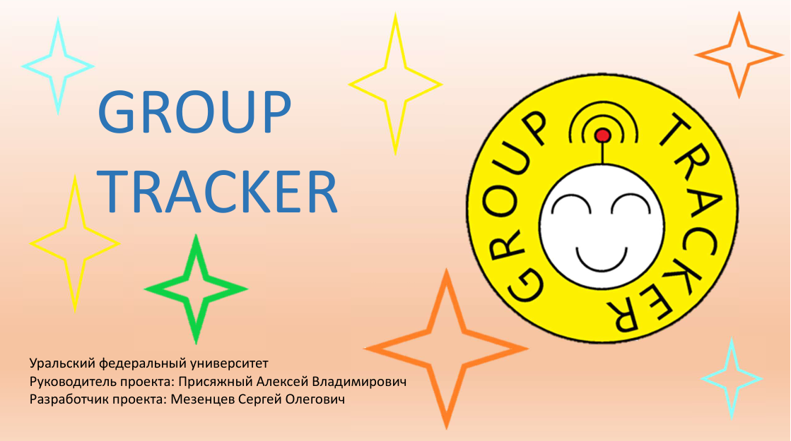

# Group Tracker

Проект **"Group tracker"** был специально разработан для учителей, вожатых, воспитателей детских садов с целью обеспечения безопасности группы детей на экскурсиях, походах и подобных мероприятиях.

Работа проекта показана в [видео-демонстрации](https://drive.google.com/file/d/1BCbQB7EiAqNkt-oI_qSkaLadIhlDDpCB/view?usp=sharing) и [видео-интсрукции](https://drive.google.com/file/d/1bX0QC1K6k9rw6bfoBOywJVJABfj6qUA2/view?usp=sharing).
Также данный проект прошел в финал, что можно увидеть на [итоговом выступлении](https://www.youtube.com/watch?v=HRJq73MMU5c&t=7320s).

### Преимущества данного решения

### Сценарий использования

Сценарий использования доволно прост!

При первом включении модуль учителя устанавливает свою точку доступа, подключившись к которой и зайдя на локальный веб-сервер, необходимо указать имя собственной сети, пароль от неё и число отслеживаемых модулей ученика. Далее модуль учителя перезагрузится, подключиться к указанной точке доступа и будет готов к работе. При повторном включении модуль учителя сразу готов к работе.

Модуль ученика же сразу входит в рабочее состояние.

Позиция же всей группы отражается при помощи модуля учителя, на котором установлен GPS-датчик и демонстрируется на платформе, предназначенной для интернета вещей.

### Блок-схема проекта

Устройства ученика и учителя сообщаются между собой при помощи радиомодулей NRF-24L01 (частота 2.4 ГГц). Также в модуле учителя находится GPS-датчик, данные с которого сначала отправляются на локальную точку доступа учителя, после чего, используя протокол MQTT, пересылаются на платформу интернет вещей.

### Модуль ученика

Модуль ученика основан на микроконтроллере Atmega 168, который отвечает за корректное использования модуля связи NRF-24L01, системы индикации в виде светодиода и микродинамика. Система питается от обычной батарейки типа "крона".

### Модуль учителя

Модуль учителя основан на микроконтроллере esp-32, который отвечает за работоспособность вышеуказанного модуля связи, GPS-модуля и светодиодов, нужных для индикации сопряжения с указанной точкой доступа и сигнала о потере какого-либо модуля ученика. Схема питается от двух аккумуляторов стандарта "18650", обеспечивающих время автономной работы более 11 часов.

### Целевая аудитория

Целевой аудиторией являются школы, детския лагеря, сады...

